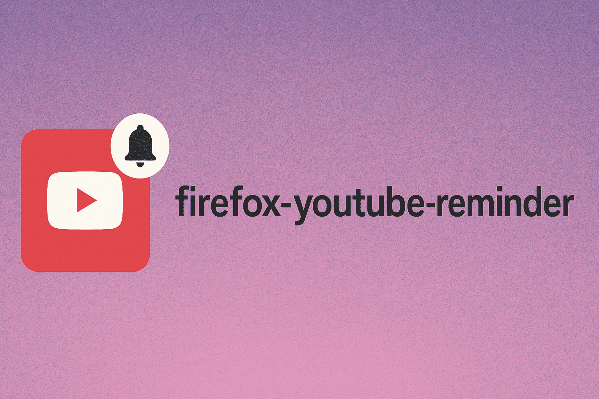

# YouTube Video Reminders Firefox Extension


A Firefox extension that allows you to set custom reminders for YouTube videos with various time intervals. Get notifications to watch your favorite videos again!

## Features

- 🎥 **Easy Setup**: Click the reminder button on any YouTube video
- ⏰ **Flexible Intervals**: Choose from hourly to monthly reminder intervals
- 🔔 **Smart Notifications**: Get browser notifications with video thumbnails
- 🎯 **One-Click Access**: Click notifications to instantly open videos
- 📱 **Modern UI**: Clean, responsive popup interface
- 💾 **Persistent Storage**: Your reminders are saved and survive browser restarts

## Installation

### For Development/Testing:

1. Open Firefox and navigate to `about:debugging`
2. Click "This Firefox" in the left sidebar
3. Click "Load Temporary Add-on"
4. Navigate to the extension folder and select `manifest.json`
5. The extension will be loaded and ready to use!

### For Production:

Package the extension and submit to Firefox Add-ons store, or load as a temporary extension for personal use.

## How to Use

### Setting a Reminder:

1. **Navigate to any YouTube video**
2. **Click the "Set Reminder" button** next to the like/dislike buttons (injected by the extension)
   - OR click the extension icon in the toolbar to open the popup
3. **Choose your reminder interval**:
   - Every Hour
   - Every 2 Hours
   - Every 6 Hours
   - Every 12 Hours
   - Daily (default)
   - Every 2 Days
   - Every 3 Days
   - Weekly
   - Every 2 Weeks
   - Monthly
4. **Add a custom note** (optional)
5. **Click "Set Reminder"**

### Managing Reminders:

- **View Active Reminders**: Click the extension icon to see all your active reminders
- **Quick Actions**: Use "View" to open a video or "Delete" to remove a reminder
- **Notification Handling**: When notifications appear, click them to open the video

### Notification Features:

- **Automatic Scheduling**: Reminders automatically reschedule based on your chosen interval
- **Snooze Option**: Click "Remind Later" to snooze for 1 hour
- **Direct Access**: Click "Watch Now" or the notification to open the video immediately

## File Structure

```
video-reminders/
├── manifest.json          # Extension configuration
├── popup.html            # Popup interface HTML
├── popup.css             # Popup styling
├── popup.js              # Popup functionality
├── content.js            # YouTube page integration
├── content.css           # Content script styling
├── background.js         # Background processes & notifications
├── icons/                # Extension icons
│   ├── icon-16.jpg
│   ├── icon-32.jpg
│   ├── icon-48.jpg
│   └── icon-128.jpg
└── README.md             # This file
```

## Technical Details

### Permissions Used:

- `storage`: Save reminder data locally
- `notifications`: Show reminder notifications
- `alarms`: Schedule timed reminders
- `tabs`: Open videos in new tabs
- `*://www.youtube.com/*`: Access YouTube pages

### Browser Compatibility:

- Firefox 60+ (Manifest V2)
- Uses WebExtensions API for cross-browser compatibility

### Data Storage:

- All reminder data is stored locally using `browser.storage.local`
- No external servers or data collection
- Data persists across browser sessions

## Development

### Key Components:

1. **Content Script** (`content.js`): Detects YouTube videos and injects reminder button
2. **Popup Interface** (`popup.html/js/css`): Main user interface for managing reminders
3. **Background Script** (`background.js`): Handles notifications, alarms, and data management

### APIs Used:

- `browser.alarms`: Schedule reminder notifications
- `browser.notifications`: Display reminder notifications
- `browser.storage.local`: Store reminder data
- `browser.tabs`: Open videos when notifications are clicked

### Environment Setup

For publishing to Mozilla Add-ons, you'll need to set up API credentials:

#### Local Development:
1. Get your API credentials from [Mozilla Add-ons Developer Hub](https://addons.mozilla.org/en-US/developers/addon/api/key/)
2. Set environment variables:
   ```bash
   export AMO_API_KEY="your-api-key"
   export AMO_API_SECRET="your-api-secret"
   ```
3. Run the publish script: `./.scripts/publish.sh`

#### GitHub Actions (Automated Publishing):
1. Go to your repository Settings → Secrets and Variables → Actions
2. Add repository secrets:
   - `AMO_API_KEY`: Your Mozilla API key
   - `AMO_API_SECRET`: Your Mozilla API secret
3. Commit with message starting with "release:" to trigger automatic publishing
   ```bash
   git commit -m "release: new feature added"
   git push
   ```

The GitHub Action will:
- Check if commit message starts with "release:"
- Build and publish the extension to Mozilla Add-ons
- Automatically bump the version number
- Commit the version changes back to the repository

## Troubleshooting

### Common Issues:

1. **Reminder button not appearing**: 
   - Refresh the YouTube page
   - Check if you're on a video page (not playlist or channel)

2. **Notifications not showing**:
   - Check Firefox notification permissions
   - Ensure the extension has notification permission

3. **Extension not loading**:
   - Check manifest.json syntax
   - Verify all file paths are correct
   - Check browser console for errors

### Debug Mode:

Open browser developer tools and check the console for any error messages from the extension.

## Privacy

- No data is sent to external servers
- All reminder data stays on your device
- No tracking or analytics
- Only accesses YouTube video information you explicitly choose to remind yourself about

## Contributing

Feel free to submit issues, feature requests, or pull requests to improve the extension!

## License

This project is open source. Use and modify as needed for your personal projects.
